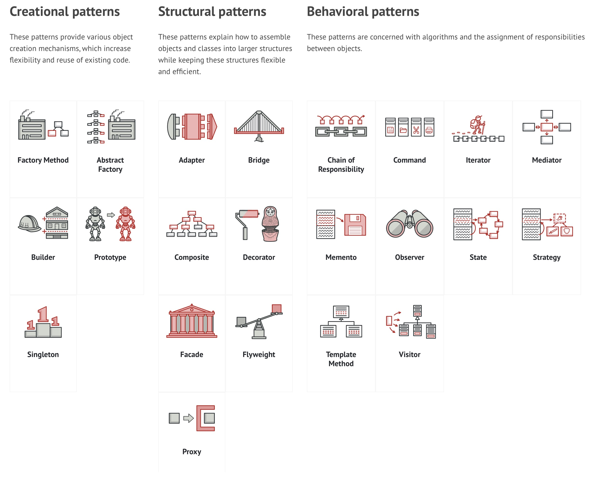

# iOS Developer Interview Preparation Materials

## Table of Contents
1. [Software Development and Process](#software-development-and-process)
    - [Architecture Knowledge](#architecture-knowledge)
        - [MVC, MVP and MVVM](#mvc-mvp-and-mvvm)
        - [VIPER, VIP, Clean](#viper-vip-clean)
        - [Redux, Flux, The Composable Architecture (TCA)](#redux-flux-the-composable-architecture-tca)
        - [Design Patterns](#design-patterns)
            - [Creational (Factory, Builder)](#creational-design-pattern-examples-factory-builder)
            - [Structural (Adapter, Facade)](#structural-design-pattern-examples-adapter-facade)
    - [Code Standards / Code Review Process](#code-standards--code-review-process)
    - [Algorithms and Data Structures](#algorithms-and-data-structures)
    - [CI/CD (Continuous Integration/Continuous Delivery/Deployment)](#cicd-continuous-integrationcontinuous-deliverydeployment)
    - [Troubleshooting / Logging / Monitoring](#troubleshooting--logging--monitoring)
    - [Testing Processes](#testing-processes)
    - [Version Control System](#version-control-system)
    - [Estimations](#estimations)
    - [Development Methodologies](#development-methodologies)
2. [Languages](#languages)
    - [Objective-C](#objective-c)
    - [Swift](#swift)
3. [SDK](#sdk)
    - [UI Development](#ui-development)
    - [Data Persistence](#data-persistence)
    - [Multithreading](#multithreading)
    - [Network](#network)
    - [User Notifications](#user-notifications)
    - [Application Lifecycle](#application-lifecycle)
    - [Deep Linking](#deep-linking)
    - [Maps](#maps)
    - [Security](#security)
    - [Bluetooth](#bluetooth)
4. [AppStore](#appstore)
    - [In-App](#in-app)
    - [Account](#account)
5. [Tools](#tools)

---

## Software Development and Process

### Architecture Knowledge

#### MVC, MVP and MVVM

- **MVC** is a traditional pattern that focuses on separating responsibilities among the model, view, and controller. 
- **MVP** and **MVVM** are variations that put more emphasis on separating presentation logic from the view. 
- **MVP** introduces a presenter layer, while **MVVM** introduces a view model layer to further decouple the view from the model.

**Key differences**:

- In **MVP**, the presenter directly interacts with the view, whereas in **MVVM**, the view model interacts with the view indirectly through data binding.
- **MVP** focuses on the presenter as the central coordinator, while **MVVM** emphasizes the view model as the mediator between the view and the model.
- **MVVM** leverages data binding to automate the synchronization between the view and the view model, reducing the need for explicit updates.

https://www.simform.com/blog/mvc-mvp-mvvm-ios-app-development/

#### VIPER, VIP, Clean

- **VIPER** *(View, Interactor, Presenter, Entity, Router)* is an architectural pattern that aims to create highly modular and decoupled code. **VIPER** enforces strict separation between components, making it easier to maintain and test each individual piece. It emphasizes loose coupling and dependency injection.

- **VIP** is a simplified version of **VIPER**, focusing on the essential components for building an iOS application:
    - *View*: Displays the user interface and handles user interactions.
    - *Interactor*: Contains the business logic and interacts with the data layer.
    - *Presenter*: Mediates between the view and the interactor, handling presentation logic.

- **Clean Architecture** is a software design principle that promotes separation of concerns and independence from external frameworks and libraries. It consists of several layers, each with its own responsibilities:
    - *Presentation Layer*: Handles user interactions, input validation, and UI rendering. It corresponds to the UI components in an iOS app.
    - *Domain Layer*: Contains the business logic and rules of the application. It is independent of the presentation layer and any external frameworks.
    - *Data Layer*: Deals with data persistence, remote API calls, and external services. It interacts with the data sources and provides data to the domain layer.

https://www.youtube.com/watch?v=Szlgqnk6gHg

#### Redux, Flux, The Composable Architecture (TCA)

#### Design Patterns

https://refactoring.guru/design-patterns/catalog

##### Creational Design Pattern Examples (Factory, Builder)

##### Structural Design Pattern Examples (Adapter, Facade)

### Code Standards / Code Review Process

### Algorithms and Data Structures

### CI/CD (Continuous Integration/Continuous Delivery/Deployment)

### Troubleshooting / Logging / Monitoring

### Testing Processes

### Version Control System

### Estimations

### Development Methodologies

---

## Languages

### Objective-C

### Swift

---

## SDK

### UI Development

### Data Persistence

### Multithreading

### Network

### User Notifications

### Application Lifecycle

### Deep Linking

### Maps

### Security

### Bluetooth

---

## AppStore

### In-App

### Account

---

## Tools
