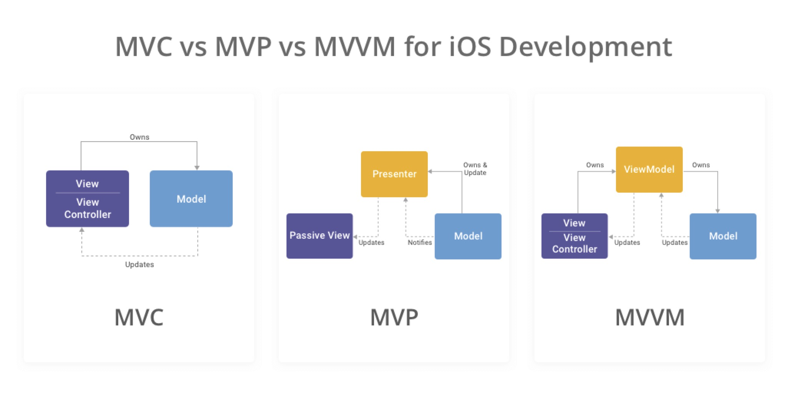
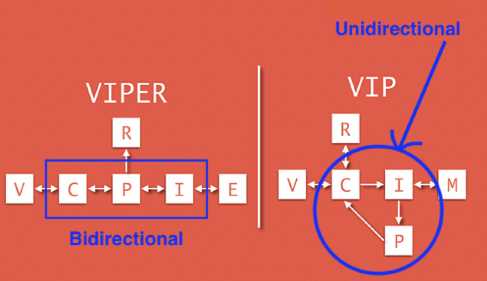
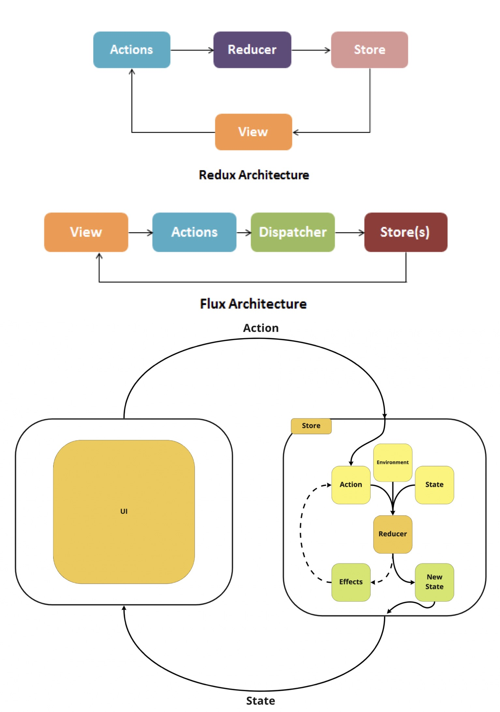

# iOS Developer Interview Preparation Materials

## Table of Contents
1. [Software Development and Process](#software-development-and-process)
    - [Architecture Knowledge](#architecture-knowledge)
        - [Architecture Patterns]()
            - [MVC, MVP and MVVM](#mvc-mvp-and-mvvm)
            - [VIPER, VIP, Clean](#viper-vip-clean)
            - [Redux, Flux, The Composable Architecture (TCA)](#redux-flux-the-composable-architecture-tca)
        - [Design Patterns](#design-patterns)
            - [Creational (Factory, Builder)](#creational-design-pattern-examples-factory-builder)
            - [Structural (Adapter, Facade)](#structural-design-pattern-examples-adapter-facade)
            - [Behavioral (Strategy)](#behavioral-design-pattern-examples-strategy)
    - [Code Standards / Code Review Process](#code-standards--code-review-process)
    - [Algorithms and Data Structures](#algorithms-and-data-structures)
    - [CI/CD (Continuous Integration/Continuous Delivery/Deployment)](#cicd-continuous-integrationcontinuous-deliverydeployment)
    - [Troubleshooting / Logging / Monitoring](#troubleshooting--logging--monitoring)
    - [Testing Processes](#testing-processes)
    - [Version Control System](#version-control-system)
    - [Estimations](#estimations)
    - [Development Methodologies](#development-methodologies)
2. [Languages](#languages)
    - [Objective-C](#objective-c)
    - [Swift](#swift)
3. [SDK](#sdk)
    - [UI Development](#ui-development)
    - [Data Persistence](#data-persistence)
    - [Multithreading](#multithreading)
    - [Network](#network)
    - [User Notifications](#user-notifications)
    - [Application Lifecycle](#application-lifecycle)
    - [Deep Linking](#deep-linking)
    - [Maps](#maps)
    - [Security](#security)
    - [Bluetooth](#bluetooth)
4. [AppStore](#appstore)
    - [In-App](#in-app)
    - [Account](#account)
5. [Tools](#tools)

---

## Software Development and Process

### Architecture Knowledge

#### Architecture Patterns

##### MVC, MVP and MVVM

- **MVC** is a traditional pattern that focuses on separating responsibilities among the model, view, and controller. 
- **MVP** and **MVVM** are variations that put more emphasis on separating presentation logic from the view. 
- **MVP** introduces a presenter layer, while **MVVM** introduces a view model layer to further decouple the view from the model.

**Key differences**:

- In **MVP**, the presenter directly interacts with the view, whereas in **MVVM**, the view model interacts with the view indirectly through data binding.
- **MVP** focuses on the presenter as the central coordinator, while **MVVM** emphasizes the view model as the mediator between the view and the model.
- **MVVM** leverages data binding to automate the synchronization between the view and the view model, reducing the need for explicit updates.



https://www.simform.com/blog/mvc-mvp-mvvm-ios-app-development/

##### VIPER, VIP, Clean

- **VIPER** *(View, Interactor, Presenter, Entity, Router)* is an architectural pattern that aims to create highly modular and decoupled code. **VIPER** enforces strict separation between components, making it easier to maintain and test each individual piece. It emphasizes loose coupling and dependency injection.

- **VIP** is a simplified version of **VIPER**, focusing on the essential components for building an iOS application:
    - *View*: Displays the user interface and handles user interactions.
    - *Interactor*: Contains the business logic and interacts with the data layer.
    - *Presenter*: Mediates between the view and the interactor, handling presentation logic.

- **Clean Architecture** is a software design principle that promotes separation of concerns and independence from external frameworks and libraries. It consists of several layers, each with its own responsibilities:
    - *Presentation Layer*: Handles user interactions, input validation, and UI rendering. It corresponds to the UI components in an iOS app.
    - *Domain Layer*: Contains the business logic and rules of the application. It is independent of the presentation layer and any external frameworks.
    - *Data Layer*: Deals with data persistence, remote API calls, and external services. It interacts with the data sources and provides data to the domain layer.



https://www.youtube.com/watch?v=Szlgqnk6gHg

##### Redux, Flux, The Composable Architecture (TCA)



#### Design Patterns

**Design patterns** are reusable code patterns that provide solutions to common software design problems. They can be applied within principles like OOP and SOLID principles to create well-structured and maintainable software.
1. Creational patterns
    - Factory Method
    - Abstract Factory
    - Builder
    - Prototype
    - Singleton
1. Structural patterns
    - Adapter
    - Bridge
    - Composite
    - Decorator
    - Facade
1. Behavioral patterns
    - Chain of Responsibility
    - Iterator
    - Mediator
    - Observer
    - State
    - Strategy
    - Visitor

https://refactoring.guru/design-patterns/catalog

##### Creational Design Pattern Examples (Factory, Builder)

**Factory** method is a pattern which solves the problem of creating product objects without specifying their concrete classes.
The **Factory** Method defines a method, which should be used for creating objects instead of using a direct constructor call (new operator). Subclasses can override this method to change the class of objects that will be created.

```
// MARK: - Factory

protocol SomeFactoryProtocol {
    func makeClassA() -> ClassA
    func makeClassB() -> ClassB
}

final class SomeFactoryImpl: FactoryProtocol {
    func makeClassA() -> ClassA {
        let classA = ClassA()
        return classA
    }
    
    func makeClassB() -> ClassB {
        let classB = ClassB()
        return classB
    }
}
```

**Builder** is a pattern that lets you construct complex objects step by step. The pattern allows you to produce different types and representations of an object using the same construction code.

```
// MARK: - Builder

final class BurgerBuilder {
    private(set) var meat: Meat = .beef
    private(set) var sauces: Sauces = []
    private(set) var toppings: Toppings = []
    
    func addSauces(_ sauce: Sauces) {
        sauces.insert(sauce)
    }
    func removeSauces(_ sauce: Sauces) {
        sauces.remove(sauce)
    }
    func addToppings(_ topping: Toppings) {
        toppings.insert(topping)
    }
    func removeToppings(_ topping: Toppings) {
        toppings.remove(topping)
    }
    func setMeat(_ meat: Meat) {
        self.meat = meat
    }
    
    func build() -> Burger {
        return Hamburger(
            meat: meat,
            sauce: sauces,
            toppings: toppings
        )
    }
}
```

##### Structural Design Pattern Examples (Adapter, Facade)

The **Adapter** pattern is pretty common in Swift code. It’s very often used in systems based on some legacy code. In such cases, **Adapters** make legacy code work with modern classes.

```
// MARK: - Adapter

class LegacyClass {
    // parameters and methods
}

// first method
final class LegacyClassAdapter: LegacyClass {
    // customize legacy class
}

final class LegacyClassAdapter2 {
    private var legacyClass = LegacyClass()
}
```

**Facade** design pattern that provides a simplified interface to a library, a framework, or any other complex set of classes.

```
// MARK: - Facade

final class Facade {
    private var subsystem1: Subsystem1
    private var subsystem2: Subsystem2

    init(subsystem1: Subsystem1 = Subsystem1(),
         subsystem2: Subsystem2 = Subsystem2()) {
        self.subsystem1 = subsystem1
        self.subsystem2 = subsystem2
    }

    func operation() -> String {

        var result = "Facade initializes subsystems:"
        result += " " + subsystem1.operation1()
        result += " " + subsystem2.operation1()
        result += "\n" + "Facade orders subsystems to perform the action:\n"
        result += " " + subsystem1.operationN()
        result += " " + subsystem2.operationZ()
        return result
    }
}

final class Subsystem1 {

    func operation1() -> String {
        return "Sybsystem1: Ready!\n"
    }

    func operationN() -> String {
        return "Sybsystem1: Go!\n"
    }
}

final class Subsystem2 {

    func operation1() -> String {
        return "Sybsystem2: Get ready!\n"
    }
    
    func operationZ() -> String {
        return "Sybsystem2: Fire!\n"
    }
}
```

#### Behavioral Design Pattern Examples (Strategy)

The **Strategy** pattern is very common in Swift code. It’s often used in various frameworks to provide users a way to change the behavior of a class without extending it. **Strategy** pattern can be recognized by a method that lets a nested object do the actual work, as well as a setter that allows replacing that object with a different one.

```
protocol FactoryProtocol {
    func makeClassA() -> ClassA
    func makeClassB() -> ClassB
}

final class FactoryImpl: FactoryProtocol {
    func makeClassA() -> ClassA {
        let classA = ClassA()
        return classA
    }
    
    func makeClassB() -> ClassB {
        let classB = ClassB()
        return classB
    }
}

final class CustomizedFactoryImpl: FactoryProtocol {
    func makeClassA() -> ClassA {
        let classA = ClassA()
        // customize...
        return classA
    }
    
    func makeClassB() -> ClassB {
        let classB = ClassB()
        // customize...
        return classB
    }
}

// MARK: - Strategy

final class SomeClass {
    private let factory: FactoryProtocol
    
    init(factory: FactoryProtocol) {
        self.factory = factory
    }
}
```

so, when creating instance of ```SomeClass```, we can provide either ```FactoryImpl``` or ```CustomizedFactoryImpl```.

### Code Standards / Code Review Process

### Algorithms and Data Structures

### CI/CD (Continuous Integration/Continuous Delivery/Deployment)

### Troubleshooting / Logging / Monitoring

### Testing Processes

### Version Control System

### Estimations

### Development Methodologies

---

## Languages

### Objective-C

### Swift

---

## SDK

### UI Development

### Data Persistence

### Multithreading

### Network

### User Notifications

### Application Lifecycle

### Deep Linking

### Maps

### Security

### Bluetooth

---

## AppStore

### In-App

### Account

---

## Tools
